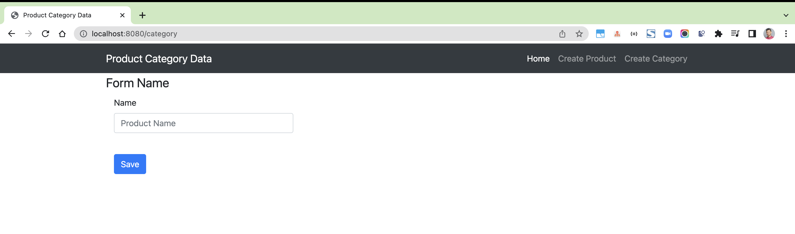
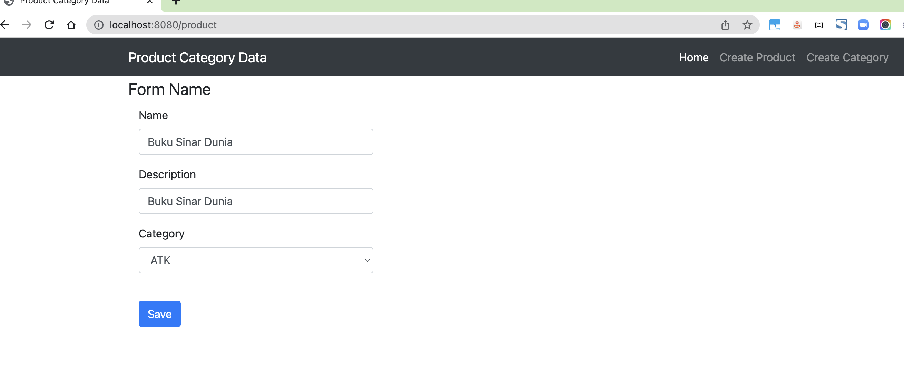
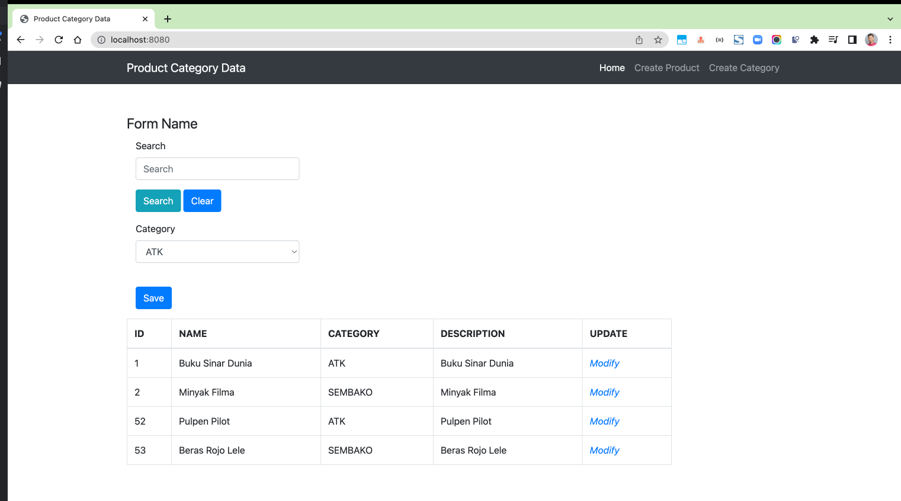

# spring-boot-product-categories-search-pagination

product add, categories add, product search, curd, pagination, thymeleaf, spring boot

* Spring-boot
* Thymeleaf
* MySQL
* Spring Data JPA

Entity

- Category
  o Id
  o Name
  o IsActive
- Product
  o Id
  o CategoryId
  o Description
  o IsActive
  Create Pages/Screen for

1. List of products
   a. Pagination
   b. Search
   c. Filter with Category (dropdown)
2. Create Category
3. Create Product
4. Update Product

### Things todo list
1. Clone this repository: `git clone https://github.com/hendisantika/spring-boot-product-categories-search-pagination.git`
2. Navigate to the folder: `cd spring-boot-product-categories-search-pagination`
3. Change the DB Credentials in `application.properties` file
4. Run the application: `mvn clean spring-boot:run`
5. Open your favorite browser: http://localhost:8080

### Image Screen shots

Add category data

Add product data

Home page

